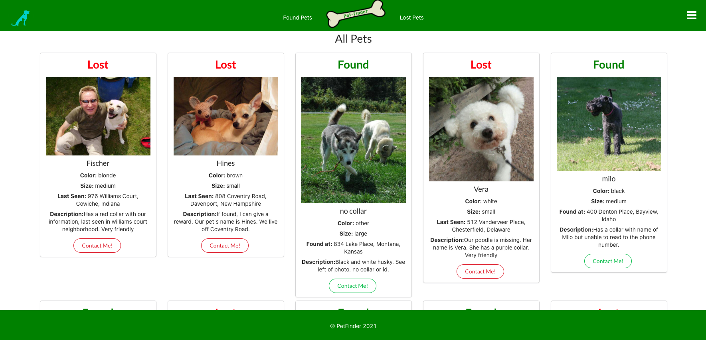
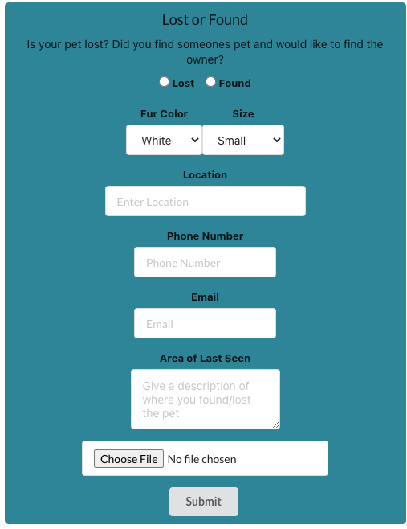
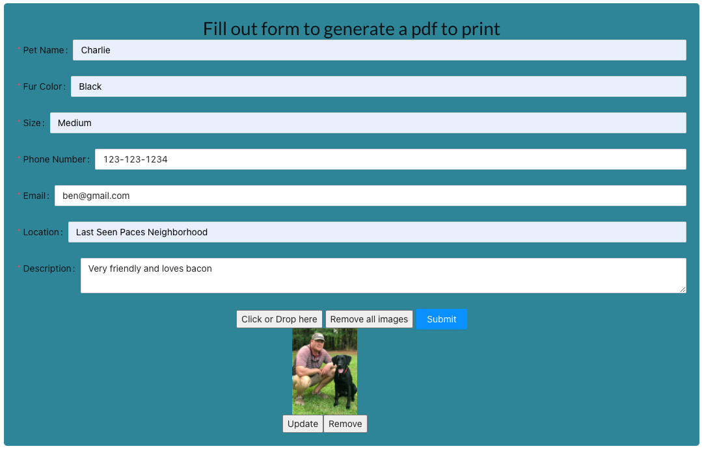
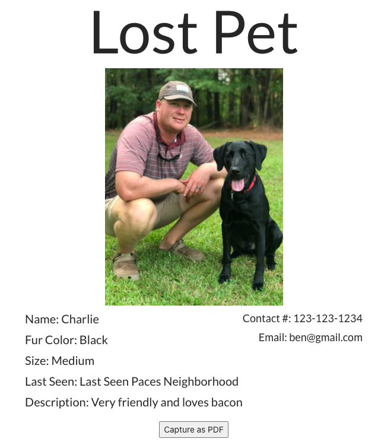

<!-- PROJECT LOGO -->
<br />
<p align="center">
  <a href="https://the-real-pet-finder.netlify.app">
    
  </a>
</p>

  <h3 align="center">Pet-Finder App</h3>
  <p align="center">
  <br />
    <a href="https://the-real-pet-finder.netlify.app">View Demo</a>
    ·
    <a href="https://github.com/bensvarnum/pet-finder/issues">Report Bug</a>
    ·
    <a href="https://github.com/bensvarnum/pet-finder/issues">Request Feature</a>
    
  </p>

<!-- TABLE OF CONTENTS -->
<details open="open">
  <summary>Table of Contents</summary>
  <ol>
    <li>
      <a href="#about-the-project">About The Project</a>
      <ul>
        <li><a href="#built-with">Built With</a></li>
      </ul>
    </li>
    <li>
      <a href="#getting-started">Getting Started</a>
      <ul>
        <li><a href="#prerequisites">Prerequisites</a></li>
        <li><a href="#installation">Installation</a></li>
      </ul>
    </li>
    <li><a href="#usage">Usage</a></li>
    <li><a href="#contributing">Contributing</a></li>
    <li><a href="#license">License</a></li>
    <li><a href="#contact">Contact</a></li>
    <li><a href="#acknowledgements">Acknowledgements</a></li>
  </ol>
</details>

<!-- ABOUT THE PROJECT -->

## About The Project


Pet-Finder was created with the user in mind. Many Lost or Found website have a less than pleasant user experience. Other than posting that you either lost a pet or found one there was no other functionality to the website. We believe Pet-Finder is the best solution to finding your pet or the pet owner.

Here's why:

- A better user interface that is eye-catching and keeps users engaged.
- The ability to create a PDF that users can print and share to find their furry friend.

### Built With

- [React](https://reactjs.org/)
- [Auth0-React](https://www.npmjs.com/package/@auth0/auth0-react)
- [Sequelize-ORM](https://sequelize.org/)
- [PostgreSQL](https://www.postgresql.org/)
- [Axios](https://www.npmjs.com/package/axios)

<!-- GETTING STARTED -->

## Getting Started

To get a local copy up and running follow these simple example steps.

### Prerequisites

Node.js will be required to run the backend server.

- Need to have [Node.js](https://nodejs.org/en/download/) installed. Open your terminal and enter the following to check.
  ```sh
  node --version
  ```

### Installation

1. Get a Google Places API Key at [Google Maps Platform](https://developers.google.com/places/web-service/get-api-key)
2. Clone the repo
   ```sh
   git clone https://github.com/bensvarnum/pet-finder.git
   ```
3. Install NPM packages
   ```sh
   npm install
   ```
4. In another directory clone the backend repo to run locally. Also will need to create a .env file.
   ```sh
   git clone https://github.com/DanielBGallagher/pet-finder-backend.git
   ```

<!-- USAGE EXAMPLES -->

## Usage

<p align='center'>








</p>

<!-- CONTRIBUTING -->

## Contributing

Contributions are what make the open source community such an amazing place to be learn, inspire, and create. Any contributions you make are **greatly appreciated**.

See the [open issues](https://github.com/othneildrew/Best-README-Template/issues) for a list of proposed features (and known issues).

1. Fork the Project
2. Create your Feature Branch (`git checkout -b feature/AmazingFeature`)
3. Commit your Changes (`git commit -m 'Add some AmazingFeature'`)
4. Push to the Branch (`git push origin feature/AmazingFeature`)
5. Open a Pull Request (`add screenshot to PR's to be accepted`)

<!-- LICENSE -->

## License

Distributed under the MIT License.

<!-- CONTACT -->

## Contact

- Benjamin Varnum - [GitHub](https://github.com/bensvarnum) - [LinkedIn](https://www.linkedin.com/in/benjamin-varnum-893b0b1ab/)
- John Lofton - [GitHub](https://github.com/JohnLoftin) - [LinkedIn](https://www.linkedin.com/in/john-loftin-1a35091b3/)
- Daniel Gallagher - [GitHub](https://github.com/DanielBGallagher) - [LinkedIn](https://www.linkedin.com/in/daniel-gallagher-b133b51b2/)

Project Github Link: [https://github.com/bensvarnum/pet-finder](https://github.com/bensvarnum/pet-finder)

Live Demo: [https://the-real-pet-finder.netlify.app/](https://the-real-pet-finder.netlify.app/)

<!-- ACKNOWLEDGEMENTS -->

## Acknowledgements

- [Semantic UI React](https://react.semantic-ui.com/)
- [Ant Design of React](https://ant.design/docs/react/introduce)
- [Font Awesome](https://fontawesome.com)
- [Google Places Api](https://developers.google.com/places/web-service/overview)

<!-- MARKDOWN LINKS & IMAGES -->
<!-- https://www.markdownguide.org/basic-syntax/#reference-style-links -->

[contributors-shield]: https://img.shields.io/github/contributors/othneildrew/Best-README-Template.svg?style=for-the-badge
[contributors-url]: https://github.com/othneildrew/Best-README-Template/graphs/contributors
[forks-shield]: https://img.shields.io/github/forks/othneildrew/Best-README-Template.svg?style=for-the-badge
[forks-url]: https://github.com/othneildrew/Best-README-Template/network/members
[stars-shield]: https://img.shields.io/github/stars/othneildrew/Best-README-Template.svg?style=for-the-badge
[stars-url]: https://github.com/othneildrew/Best-README-Template/stargazers
[issues-shield]: https://img.shields.io/github/issues/othneildrew/Best-README-Template.svg?style=for-the-badge
[issues-url]: https://github.com/othneildrew/Best-README-Template/issues
[license-shield]: https://img.shields.io/github/license/othneildrew/Best-README-Template.svg?style=for-the-badge
[license-url]: https://github.com/othneildrew/Best-README-Template/blob/master/LICENSE.txt
[linkedin-shield]: https://img.shields.io/badge/-LinkedIn-black.svg?style=for-the-badge&logo=linkedin&colorB=555
[linkedin-url]: https://linkedin.com/in/othneildrew
[product-screenshot]: images/screenshot.png
